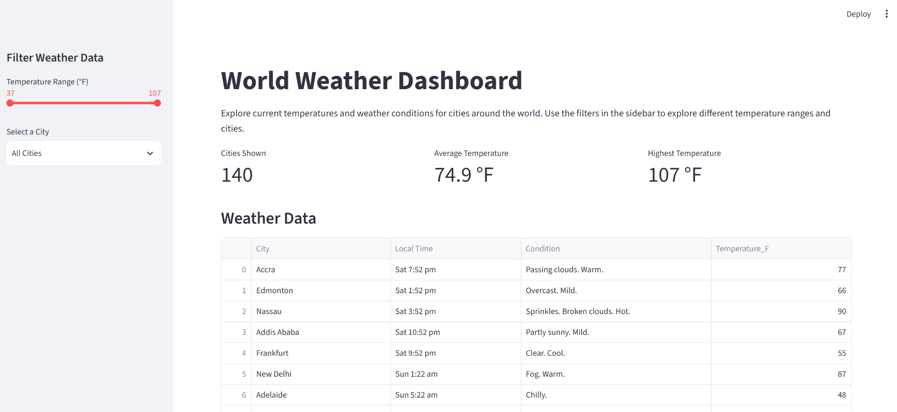
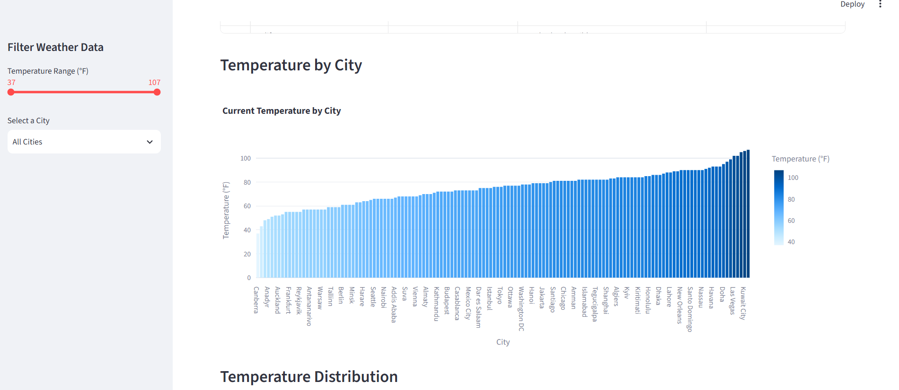
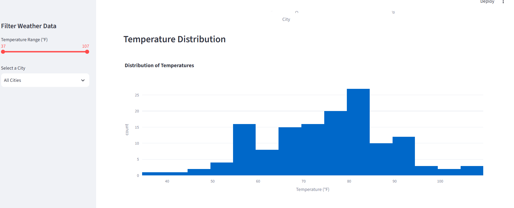
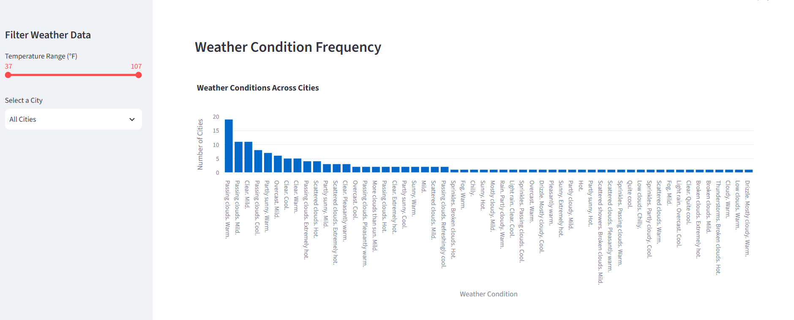

# World Weather Web Scraping and Dashboard Project

## Project Overview

This project collects weather data for cities around the world, cleans and transforms the collected data, stores the cleaned data in a SQLite database, and presents the results through an interactive Streamlit dashboard.

The project demonstrates a complete data pipeline:

**Web Scraping → CSV → Data Cleaning → SQLite Database → Streamlit Dashboard**

## Technologies Used

- Python
- Selenium
- Pandas
- SQLite
- Streamlit
- Plotly
- Git and GitHub

## Project Files

- `scrape_weather.py` - Scrapes weather information from the web using Selenium.
- `weather_raw.csv` - Stores the raw scraped weather data.
- `clean_weather.py` - Cleans and transforms the raw weather data using Pandas.
- `weather_clean.csv` - Stores the cleaned version of the weather data.
- `weather_database.py` - Loads the cleaned weather data into SQLite.
- `weather.db` - SQLite database containing the cleaned weather information.
- `streamlit_app.py` - Creates the interactive World Weather Dashboard.
- `requirements.txt` - Lists the Python packages required to run the project.
- `service_urls.txt` - Contains the public URL for the deployed Streamlit dashboard.

## Web Scraping

Weather data is collected using Selenium.

The scraping process gathers weather information for cities around the world and stores the original results in:

`weather_raw.csv`

The scraper is designed to collect the required information without making unnecessary duplicate requests.

## Data Cleaning and Transformation

The raw weather data is loaded into a Pandas DataFrame for cleaning and transformation.

The cleaning process handles issues such as:

- Missing values
- Duplicate records
- Malformed or inconsistent values
- Data type conversions
- Unnecessary or unusable data

The project keeps both the raw and cleaned datasets so the before-and-after stages of the data can be compared.

The cleaned dataset is saved as:

`weather_clean.csv`

## SQLite Database

After cleaning, the transformed weather data is loaded into a SQLite database.

Database file:

`weather.db`

The Streamlit dashboard reads the weather information from this database.

## World Weather Dashboard

The project includes an interactive dashboard built with Streamlit.

The dashboard allows users to explore weather information for cities around the world.

### Dashboard Features

- Displays weather data in an interactive table
- Shows key weather metrics
- Includes at least three data visualizations
- Provides a temperature range slider
- Provides a city selection dropdown
- Updates dashboard information based on user selections
- Uses Plotly for interactive visualizations
- Provides titles and descriptions to help users understand the data

### Screenshots






## Running the Dashboard Locally

1. Create a virtual environment:

```bash
python -m venv .venv
```
